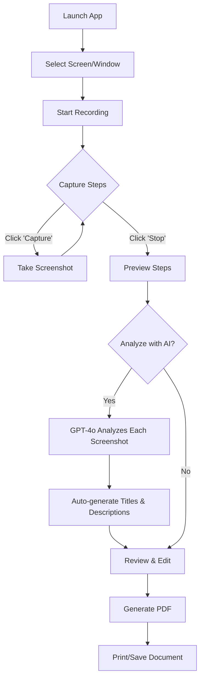

# QuickFlow - Project Documentation

> **Generated:** 2026-01-22  
> **Project Type:** Desktop (Electron)  
> **Status:** Active Development

## 📋 Overview

**QuickFlow** is a desktop application that automatically generates documented procedures from screen recordings. It captures screenshots at each step, uses OpenAI's GPT-4 Vision to analyze and describe each action, then generates a professional PDF document.

### Target Users
- IT departments creating technical procedures
- Training teams documenting workflows
- Anyone needing to create step-by-step guides

---

## 🏛️ Architecture Overview

```
┌─────────────────────────────────────────────────────────────┐
│                    QuickFlow Application                     │
├─────────────────────────────────────────────────────────────┤
│  ┌─────────────────┐    IPC     ┌─────────────────────────┐ │
│  │   Main Process  │◄──────────►│    Renderer Process     │ │
│  │   (main.js)     │            │    (src/app.js)         │ │
│  │                 │            │                         │ │
│  │ • Window mgmt   │            │ • UI State management   │ │
│  │ • Screen capture│            │ • User interactions     │ │
│  │ • File I/O      │            │ • OpenAI API calls      │ │
│  │ • Config storage│            │ • PDF generation        │ │
│  └─────────────────┘            └─────────────────────────┘ │
│           │                               │                  │
│           │ preload.js                    │                  │
│           │ (Secure Bridge)               ▼                  │
│           │                     ┌─────────────────────┐     │
│           │                     │   OpenAI API        │     │
│           │                     │   (GPT-4o-mini)     │     │
│           │                     └─────────────────────┘     │
│           ▼                                                  │
│  ┌─────────────────┐                                        │
│  │ Local Storage   │                                        │
│  │ • config.json   │                                        │
│  │ • output/*.pdf  │                                        │
│  └─────────────────┘                                        │
└─────────────────────────────────────────────────────────────┘
```

---

## 📁 Project Structure

```
quickflow-app/
├── main.js              # Electron main process
├── preload.js           # Secure IPC bridge
├── package.json         # Dependencies & build config
├── config.json          # API key storage (gitignored)
├── src/
│   ├── index.html       # UI with Tailwind CSS
│   └── app.js           # Application logic
├── assets/
│   └── icon.png         # App icon
├── output/              # Generated PDFs (created at runtime)
└── dist/                # Build output
```

---

## 🔧 Key Components

### [main.js](file:///c:/Users/GRECO/.gemini/antigravity/scratch/Quickflow/quickflow-app/main.js) - Main Process
- **Window Management:** Creates 900x700 BrowserWindow with dark theme
- **IPC Handlers:**
  - `get-sources` - Lists available screens/windows for capture
  - `capture-screenshot` - Captures current screen state
  - `save-session` - Saves session data as JSON
  - `save-pdf` - Writes PDF buffer to output folder
  - `get-api-key` / `save-api-key` - API key management
  - `open-output-folder` - Opens output directory in explorer

### [preload.js](file:///c:/Users/GRECO/.gemini/antigravity/scratch/Quickflow/quickflow-app/preload.js) - Security Bridge
Exposes secure `electronAPI` to renderer:
- `getSources()`, `captureScreenshot()`, `saveSession()`, `savePdf()`
- `getApiKey()`, `saveApiKey()`, `openOutputFolder()`

### [src/app.js](file:///c:/Users/GRECO/.gemini/antigravity/scratch/Quickflow/quickflow-app/src/app.js) - Application Logic
**State Management:**
```javascript
const state = {
    selectedSource: null,
    isRecording: false,
    recordingStartTime: null,
    steps: [],
    apiKey: null
};
```

**Key Functions:**
| Function | Purpose |
|----------|---------|
| `loadSources()` | Fetches available capture sources |
| `captureStep()` | Captures current screen as step |
| `analyzeWithAI()` | Sends screenshots to GPT-4o-mini |
| `generatePDF()` | Creates printable HTML document |

### [src/index.html](file:///c:/Users/GRECO/.gemini/antigravity/scratch/Quickflow/quickflow-app/src/index.html) - User Interface
- **Framework:** Tailwind CSS (CDN)
- **Fonts:** Plus Jakarta Sans (Google Fonts)
- **Icons:** Font Awesome 6.4
- **Views:** Source Selection → Recording → Preview/Edit

---

## 🔌 External Dependencies

| Package | Version | Purpose |
|---------|---------|---------|
| `electron` | ^28.0.0 | Desktop framework |
| `openai` | ^4.24.0 | AI API client |
| `jspdf` | ^2.5.1 | PDF generation (unused currently) |
| `html2canvas` | ^1.4.1 | Screenshot to image (unused currently) |
| `electron-builder` | ^24.9.1 | App packaging |

---

## 🔐 Security Considerations

> [!WARNING]
> **API Key Exposure:** `config.json` contains the OpenAI API key in plaintext. Ensure this file is properly gitignored.

- ✅ Context isolation enabled
- ✅ Node integration disabled
- ✅ Secure preload bridge pattern
- ⚠️ API key stored locally without encryption

---

## 🚀 User Flow



---

## 📊 Current State Assessment

### ✅ Implemented
- Screen/window source selection
- Manual step capture during recording
- AI-powered screenshot analysis (GPT-4o-mini)
- Auto-generated titles and descriptions
- PDF generation via print dialog
- Settings modal for API key
- Modern dark UI with Tailwind

### 🔄 Potential Improvements
- [ ] Automatic click detection (currently manual capture)
- [ ] Direct PDF save (not just print dialog)
- [ ] Click position highlighting on screenshots
- [ ] Multiple procedure templates
- [ ] Export to Word/Markdown
- [ ] Procedure versioning
- [ ] Keyboard shortcuts for capture

---

## 📚 Related Documentation

- [Architecture Details](./architecture.md)
- [API Reference](./api-reference.md)
- [Development Guide](./development.md)
